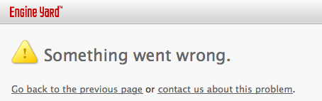

!SLIDE[bg=pictures/surfpier.jpg] black
### Jacob Burkhart
    
    
     
## jacobo.github.com/building_services
## @beanstalksurf

.notes Hi there. This is me. I'm Jacob Burkhart. You can tweet at me there or download this presentation.  

!SLIDE[bg=pictures/whatamidoing.jpg] bullets incremental
### What do I know?

.notes This talk my story of building and living with a distributed architecture. This is the first time I've given a talk in Israel. It's also the first time I've given a technical talk. Last time I gave a talk at a ruby conference I talked about Surfing. This talk is going to be very different, but there's one key point that remains the same. This is a story of my experiences and what has worked for me. I'm not here to give you instructions on what to do. I only hope to inspire you. Maybe you'll face some problems similar to the ones I'm going to describe. Hopefully sharing my experience will help you to solve them better than I did.

!SLIDE[bg=pictures/engineyardcloud.png]
## Engine Yard

.notes This is where I work. Thank you to them for sponsoring this conference and sending me here. And this is what this talk is about. Because at Engine Yard we have a fairly large and complicated product...

!SLIDE[bg=screenshots/addons.png]

.notes this is EY Addons

!SLIDE
# Documentation First

  

.notes But, documentation has a price (just like code) the more you write, the more you need to maintain

!SLIDE[bg=diagrams/ey_soa_overview.png] h3overlaybullet bullets incremental
* <h3>Service-Oriented Architecture</h3>

.notes and it consists of a lot of services.  We DO have the monolithic app syndrome. (that's our cloud dashboard in the middle). But we've been gradually been adding new features. And whenever we do we look for ways they can be added as separate services.  By the way, I colored those 3 boxes because those are the services that I'm going to talk about today.

!SLIDE[bg=diagrams/just_addons.png] bullets rightside-bullets incremental
### Why Distributed?
* Minimize additions to   Cloud Dashboard
* Forced Decouple

.notes Why build this as a distributed system? We could just add everything into the main rails app: Cloud Dashboard.

!SLIDE[bg=pictures/solowave.jpg] align-left shadowed
# Every piece of knowledge must have a single, unambiguous, authoritative representation within a system.

.notes This is the "DRY" principle. It applies to our systems, And it applies to our data model. We can extend "knowledge" to "data". One piece of data should have 1 authority.

!SLIDE[bg=diagrams/datamodel_simple.png] moredarkness
### DRY in a distributed system

.notes this is a simple example of the data model for addons. DRY means understanding the data model and which system is responsible for what role and what piece of data.

!SLIDE[bg=pictures/distributed_objects.jpg]
### Distributed Objects

.notes Your data is distributed across systems. You'll need APIs to fetch/provide remote data when/where you need it.

!SLIDE smaller_p
### Distributed Objects

    @@@ ruby
    class Service < ActiveRecord::Base
      belongs_to :partner

      has_many :service_accounts, :dependent => :destroy

      validates_presence_of :partner_id
    end
&nbsp;

    @@@ ruby
    class Service < APIStruct.new(:name, :service_accounts_url)
      attr_accessor :connection
      attr_accessor :url

      def destroy
        connection.destroy_service(self.url)
      end
    end

!SLIDE[bg=diagrams/datamodel.png]

.notes this is the diagram I actually created and maintained during development

.notes SHAI says maybe show this in code. Let me tell you about distributed objects. This is about relationships that go across systems.

!SLIDE[bg=pictures/pointing.jpg]
### APIs

.notes The keyword in API is interface. When I talk about APIs I'm talking about interfaces across systems. But what is a system. When you write a single rails app you don't think about your APIs as much but you do have objects interacting. When your system spans codebases and run on separate machines, you have to formalize your APIS more. But they are there even in a single rails app.

!SLIDE[bg=diagrams/just_addons.png]

.notes back to the diagram of the 3 systems

!SLIDE[bg=diagrams/just_addons_really.png]

.notes FOCUS: communication goes across the systems. (more important than what it actually is) Here's what it looks like with the cross-app APIs defined. Notice that Addons actually has 2 distinct APIs for public and private, and then each API has two parties. For convenience we call one the server and one the client, but they do more than that.

!SLIDE[bg=diagrams/addons_workflow.png] h3overlaybullet bullets incremental
* <h3>Where To Start?</h3>

.notes here's a workflow of a user using the cloud dashboard to enable a service for their app. This one UI action triggers a chain of calls and responses that create new data in each system.

!SLIDE[bg=pictures/complexity.jpg]
### Complexity

!SLIDE bullets incremental
# Iteration

* Solve a small subset of one use case.
* Gradually add features/complexity.

.notes start with just "enable service" and assume that we already know about the services etc.. 

!SLIDE bullets incremental
# Isolation

* Solve simple problems in isolation
* Combine the simple solutions into a complex solution

.notes develop on just one of the 3 parts at time, and use a mock so we can write tests.

!SLIDE[bg=diagrams/addons_workflow.png] black align-left
## from this

.notes we we'll go from the production use case where everything talks

!SLIDE[bg=diagrams/addons_workflow_mock.png] black align-left
## to this

.notes to using a mock

!SLIDE
   
   
# Every API Client needs a mocked mode.

.notes there are lots of way to actually implement a mocked mode. One of the coolest examples is fog. Shai is going to go into deeper details in his talk later about the different ways you can setup a mocked mode. I just want to introduce the concept.

!SLIDE[bg=pictures/wes.jpg] h2bottomright
### Wes
## @geemus

!SLIDE[bg=/bg_demo.jpg] marginlessimage

    @@@ ruby
    require 'fog'
    creds = {provider: 'AWS',
      aws_access_key_id: 'a123',
      aws_secret_access_key: 'b456'}
    fog = Fog::Compute.new(creds)
    fog.servers

    Fog.mock!
    fog = Fog::Compute.new(creds)
    fog.servers
    fog.servers.create
    fog.servers
    fog.servers.first.destroy
    fog.servers
    fog.servers

.notes Demo. here's an example of using fog to call AWS web services in test. We ask amazon to boot an instance, and it happens immediately, and fog responds as if it worked, there's even a delay feature.

!SLIDE bullets incremental align-left
# Approach so far
* Documented Use Cases
* Distributed Data Model
* Identified APIs
* Iterate: start at minimal use case
* Isolate using Mock-Mode

.notes FOCUS: spend more time here. Obvious stuff so far.

!SLIDE bullets incremental align-left
# Let's write some code

* Private API client
* Cloud Dashboard
* Public API client
* Fake Service
* Add-ons Service

.notes This was a reasonable mistake to make. At Engine Yard we always like to ship things to production as early as possible. We hide them behind a feature flag and so it doesn't matter if they are live.  So reasonably I thought to immediately make all of these things.

!SLIDE
# Tests Pass

.notes so I thought this was great right. I just wrote all this code, but only like 1/5 of it had to be in AWSM (the slow monolith), so for the most part I was writing greenfield code, and my TDD went fast.

!SLIDE
# Deploy and...

.notes so I got all this into production

!SLIDE bullets incremental align-left
# What went wrong

* Don't know   

!SLIDE bullets incremental align-left
# Real Problem

* No visibility of interactions
* No integration tests

.notes Because this is distributed system. Nothing was fundamentally wrong with what we were doing, but something was missing.  No visibility is the orange arrows.

!SLIDE[bg=pictures/beachponder.jpg]
### Full integration tests are hard

!SLIDE[bg=pictures/tim.jpg] h2bottomright
### Tim
## @halorgium

.notes the term spike generally refers to throwaway code that you write to try out an idea with the goal of figuring out all the questions you didn't know to ask. What will you stumble on. What assumptions can you discover that are wrong before you go too far down a given path.  Usually you don't write tests, or you write very minimal tests.

!SLIDE[bg=pictures/tim.jpg]
 
### That's crazyness.
### Write a Spike.

!SLIDE[bg=pictures/urchin.jpg] align-left bullets incremental
### Spike
* Throwaway Code
* No Tests
* Full Integration

.notes usually, a spike is throwaway code.

!SLIDE video
<video controls="controls">
  <source src="./recordings/spikedemo.mov" type="video/mp4">
</video>

.notes clicking around

!SLIDE[bg=pictures/sidewayspalm.jpg]
### The Spike becomes an integration test

!SLIDE
# The Spike becomes an integration test

    @@@ ruby
    #spec_helper.rb
    Capybara.app = Rack::Builder.new do
      use RequestVisualizer
      map "http://addons.ey.test/" do
        run AddonsService::Application
      end
      map "http://cloud-dashboard.test/" do
        run CloudDashboard::Server
      end
      map "http://example-service.partner/" do
        run ExampleService::Server
      end
    end
    Artifice.activate_with(Capybara.app)

!SLIDE
# The Spike becomes an integration test

    @@@ ruby
    #enable_spec.rb
    visit "http://cloud-dashboard.test"
    click_link "signup!"
    fill_in "Name", with: "new-customer"

    click_button "Create Account"
    click_link "Addons"
    click_button "Enable Example Addon"

    page.should contain("Example Addon enabled!")

!SLIDE[bg=pictures/boards.jpg]
### A Few Good Integration Tests

!SLIDE[bg=pictures/drivingit.jpg]
### Integration tests   drive "real" code   (and real tests)

!SLIDE
### 2 Mock Modes

    @@@ ruby
    # ey_services_api/spec/spec_helpers.rb
    if ENV["BUNDLE_GEMFILE"] == "EYIntegratedGemfile"
      #run our tests against the real thing
      require 'addons_service'
      EY::ServicesAPI.mock!(
        AddonsService::Application)
    else
      #run our tests against a fake version
      require 'ey_services_api/fake'
      EY::ServicesAPI.mock!(
        EyServicesAPI::FakeForAddonsService)
    end

.notes SHAI tie in. there are different approaches to doing this... In my case I wrote tests in my API client that could run against either the "mock" server OR the "real" server. I used 2 gemfiles and the "internal" one actually includes the full Addons project as a gem.

!SLIDE[bg=diagrams/crazymocks.png]

.notes and just to re-iterate that this stuff is complicated

!SLIDE
# Time to ship!

.notes this is what I tried to do originally, but I needed to heed the other lessons first. With verifiable API clients and mock modes I could work in a single repository at a time, and be confident that if my tests pass, things will work when I deploy to production.

!SLIDE
### Ship it behind a Feature Flag

    @@@ ruby
    class Account < ActiveRecord::Base
      has_many :account_features
      has_many :features, :through => :account_features

      def has_feature?(name)
        features.where(name: name).any?
      end
    end
&nbsp;

    @@@ ruby
    - if @account.has_feature?('addons')
      = link_to "Addons", account_addons_url(@account)

!SLIDE
# Log and Share Exceptions

  

.notes we actually show partners a debug console with exception traces for recent errors.

!SLIDE
# Log and Share Exceptions

  

.notes A 200 status code means the server handled the request successfully, but doesn't guarantee the client can parse and understand the response.

!SLIDE[bg=pictures/bottlecapper.jpg]
### Tools

!SLIDE
# Distributed Codebase: Bundler Path

    @@@ ruby
    #fetches from rubygems
    gem 'showoff'
&nbsp;

    @@@ ruby
    #fetches from github
    gem 'ey_services_api', 
      git: 'git://github.com/jacobo/showoff.git'
&nbsp;

    @@@ ruby
    #fetches from local repo
    gem 'ey_services_api', path: '../showoff'

.notes Develop everything locally with bundler path, and you can use bundler git so you don't have to publish your gems while you are still in development

!SLIDE larger
  
# Rack

!SLIDE[bg=/bg_demo.jpg]
### Minimal Rack app

    @@@ ruby
    miniapp = lambda{|env| [200, {}, ["Hello World"]]}

    miniapp.call({})

!SLIDE[bg=/bg_demo.jpg]
### Sinatra is Rack

    @@@ ruby
    require 'sinatra/base'
    class SinatraApp < Sinatra::Base
      get "/hi" do
        "Hello There"
      end
    end

    SinatraApp.call('REQUEST_METHOD' => 'GET',
      'PATH_INFO' => '/hi', 'rack.input' => StringIO.new)

!SLIDE[bg=/bg_demo.jpg]
### Rails is Rack

    @@@ ruby
    require 'action_controller/railtie'
    class ShortRailsApp < Rails::Application
    config.secret_token="abc"; Rails.logger=Logger.new(nil)
    config.middleware.delete(Rack::Lock); "ok"; end

    class HiController < ActionController::Base
      def index
        render :text => "hello"
      end
    end
    ShortRailsApp.routes.draw do
      match "/", :to => "hi#index"
    end

    ShortRailsApp.call("REQUEST_METHOD"=>"GET", 
      "PATH_INFO"=>"/", "rack.input" => StringIO.new)

!SLIDE[bg=/bg_demo.jpg] bullets incremental
### Artifice

    @@@ ruby
    require 'net/http'
    Net::HTTP.get_print(URI.parse('http://google.com'))

    require 'artifice'
    Artifice.activate_with(ShortRailsApp)
    Net::HTTP.get_print(URI.parse('http://google.com/'))
    Artifice.deactivate

*  `Artifice.activate_with(Capybara.app)`

!SLIDE[bg=/bg_demo.jpg]
### <s>

Artifice</s> rack-client

    @@@ ruby
    require 'rack/client'
    client = Rack::Client.new
    client.get('http://google.com', {}).body

    client = Rack::Client.new{ run ShortRailsApp }
    client.get('http://google.co/', {}).body

!SLIDE[bg=/bg_demo.jpg]
### Rack map

    @@@ ruby
    mapped_app = Rack::Builder.new do
      map "http://miniapp/" do
        run miniapp
      end
      map "http://sinatraapp/" do
        run SinatraApp
      end
      map "http://railsapp/" do
        run ShortRailsApp
      end
    end

    client = Rack::Client.new{ run mapped_app }
    client.get('http://railsapp/', {}).body
    client.get('http://sinatraapp/hi', {}).body
    client.get('http://miniapp/foobarbaz', {}).body

!SLIDE
# `use RequestVisualizer`

  

.notes FOCUS: link to the arrows. So we went through all these various use cases with this basic framework of what I called the spike. But development could be easier. A big problem was that I was pairing and it was hard to make my pair understand everything that was going on, because my only tests were too high level. so I wrote this little middleware that let me see a trace of the API traffic

!SLIDE bullets incremental
### pow   <small>http://pow.cx/</small>

* `myapp.dev` + `otherapp.dev`   vs.   `localhost:3000` + `localhost:4000`
* 

!SLIDE bullets incremental
### <s>

pow</s> <small>*.localdev.engineyard.com</small>
* anything.localdev.engineyard.com:3000 ==   localhost:3000
* 

!SLIDE bullets incremental
### <small>*.localdev.engineyard.com</small>

    @@@ ruby
    # config.ru
    BILL_HOST = "http://billing.localdev.engineyard.com:3000/"
    CLOUD_HOST = "http://cloud.localdev.engineyard.com:3000/"
    if Rails.env == "development"
      map BILL_HOST do
        run Billing::Application
      end
      map CLOUD_HOST do
        run CloudDashboardFake
      end
    else
      run Billing::Application
    end

!SLIDE[bg=pictures/seals.jpg]
   
   
### What else?

!SLIDE bullets incremental
# Domain model   !=   Database model

    @@@ ruby
    def present_service
      {
        :service => {
          :name => @service.name,
          :enabled => @service_account.exists?
        }
      }.to_json
    end

.notes because at some point you'll probably want to change one without changing the other
.notes because your API client doesn't need to know everything

!SLIDE
 
# The best identifier is a URL

    @@@ ruby
    create_service(:name => "MyAddon")
    => {"url" => "https://services.engineyard.com/services/55",
        "name" => "MyAddon"}

.notes because then you don't need to construct URLs
.notes REST (and thus usefulness) will likely fall out.
.notes example of the URL you get identifying an account, you can GET to for the information again.
.notes the URL to POST to register a service is also a listing of services you've registered

!SLIDE
# Involve your designers early

.notes when your API is the backend for a web interface, changes to what the designers what to show on what screen, will dictate changes to what your various API endpoints need to return

!SLIDE[bg=pictures/boardsonthebeach.jpg]
### Questions?
    
    
     
## github.com/jacobo/building_services
## @beanstalksurf